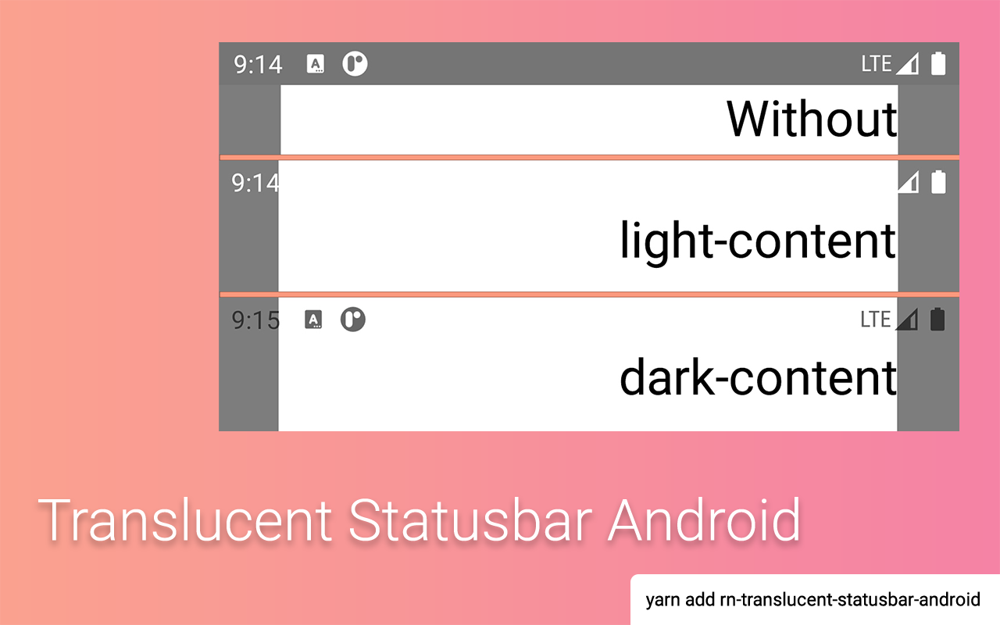

## Translucent Statusbar Android

[](https://www.npmjs.com/package/rn-translucent-statusbar-android)
[](https://www.npmjs.com/package/rn-translucent-statusbar-android)



### Installation

```sh
npm install rn-translucent-statusbar-android
```

or

```sh
yarn add rn-translucent-statusbar-android
```

### Usage

```diff
+++ index.js

import { AppRegistry } from "react-native";
import App from "./src";
import { name as appName } from "./app.json";
+ import hiddenStatus from "rn-translucent-statusbar-android";

+ hiddenStatus("light-content");
AppRegistry.registerComponent(appName, () => App);
```

### License

MIT

### Pull requests

Always welcome!
